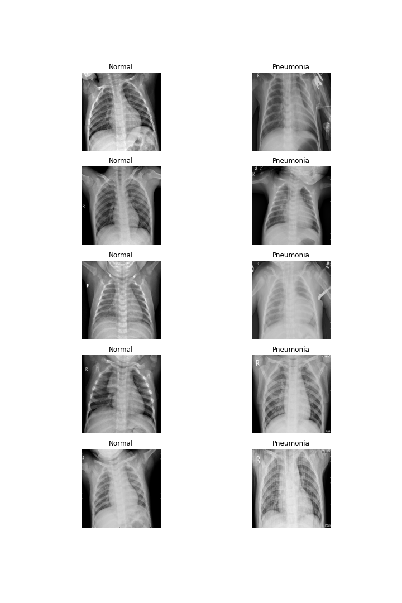

# Pnuemonia Image Classification

## Initial Data Analysis

**Wesley Giles**

### Business problem:

Doctors and Radiologists are overwhelemed by the number of X-rays they have to look at to treat patient's for various diseases, including pnuemonia. Creating a machine learning model that will be able to quickly identifiy a patient's likelyhood of having pneumonia can decrease wait times for treatment and reduce strain on hospital staff, leading to a better quality of care.

### Data:
The dataset for given for evalution had 5586 usable images sorted into two categories, those which had pnuemonia, and those whose results came back normal. These images were further split into training, testing, and validation sets.

> Example Images from train Dataset

## Methods
- Data was explored and cleaned through processes such as checking for duplicated data and manually inspecting outliers
- After the inital data exploration phase, a generator as created to slightly modify the training images in order to increase the data available to the model
- Finally the model was fit and tested against the validation

## Results

## Model

The final model was a convolutional nueral network implemented using keras and trained with an early stopping callback to prevent overfitting

## Recommendations:

## Limitations & Next Steps

### For further information

For any additional questions, please contact **Wesley@SeraphDev.com**