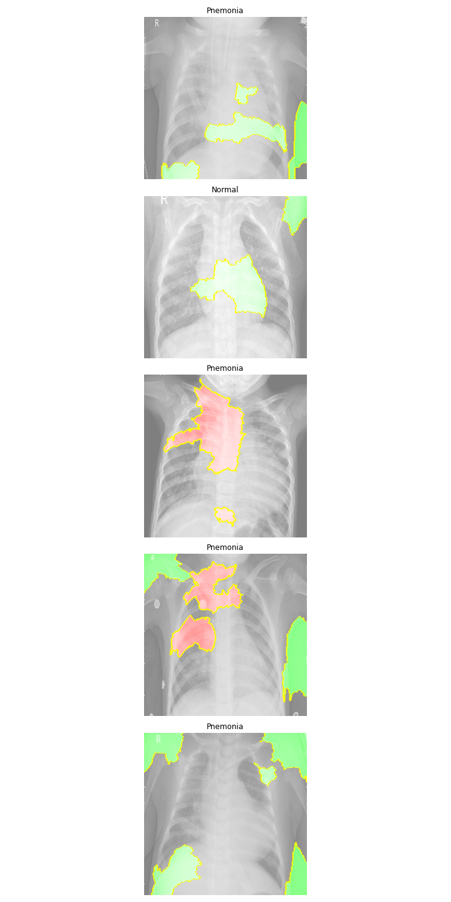

# Pnuemonia Image Classification

## Initial Data Analysis

**Wesley Giles**

### Business problem:

Doctors and Radiologists are overwhelemed by the number of X-rays they have to look at to treat patient's for various diseases, including pnuemonia. Creating a machine learning model that will be able to quickly identifiy a patient's likelyhood of having pneumonia can decrease wait times for treatment and reduce strain on hospital staff, leading to a better quality of care.

### Data:
The dataset for given for evalution had 5586 usable images sorted into two categories, those which had pnuemonia, and those whose results came back normal. These images were further split into training, testing, and validation sets.

> Example Images from train Dataset

## Methods
- Data was explored and cleaned through processes such as checking for duplicated data and manually inspecting outliers
- After the inital data exploration phase, a generator as created to slightly modify the training images in order to increase the data available to the model
- Finally the model was fit and tested against the validation

## Results

The intial results of the modeling process revealed biases in areas of the scan which should not be considered when diagnosing pnuemonia, leading to the conculusion that a much wider dataset is needed to train a model to perform this task accurately. Despite this, early modeling efforts showed a strong ability to recognize pneumonia cases in the validation set of images, with some false positives being reported. Overall, this show the potential of a model trained with a much more diverse dataset.

> Examples of abnormal features, implying biases in data

## Model

The final model was a convolutional nueral network implemented using keras and trained with an early stopping callback to prevent overfitting. The model trained only on original images with no deformations applied performed better on the validation dataset, despite performing worse on the testing set of images.

## Recommendations:

A larger, more diverse, set of data is needed to properly train the model, as biases in protocol and positioning seem to be sffecting the model's ability to accurately predict unfamiliar images. While this model is helpful on showing the potential of this technology it is far from a complete solution.

## Limitations & Next Steps

 A request should be made to reasearch hospital interested in this field of study to provide additional data for the purposes of getting a more complete model. With additional data from other hospitals we will be able to reduce bias in the model, and provide more training data for the model to more effectively predict pneumonia, using features that are in the lungs, rather than outside of them.

### For further information

For any additional questions, please contact **Wesley@SeraphDev.com**